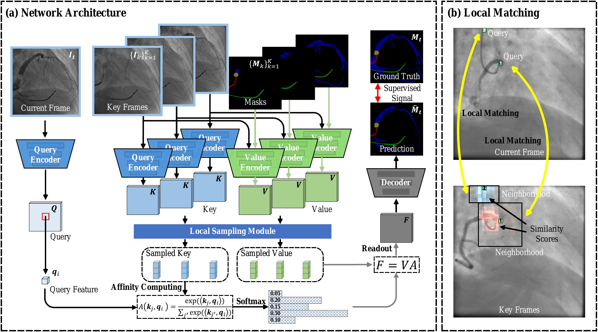

# XRAVOS: Few-Shot Video Object Segmentation in X-Ray Angiography

This repository is the official implementation of the paper:
**"Few-Shot Video Object Segmentation in X-Ray Angiography Using Local Matching and Spatio-Temporal Consistency Loss"**

---

## 📢 News
- **[2026.03.05]**: Repository created. We are currently cleaning up the code for public release. Stay tuned! 🚀
- **[2026.03.30]**: Full codebase for training and inference is now available. 🎉

---

## ✨ Introduction

Video Object Segmentation (VOS) in X-ray angiography is challenging due to low contrast, overlapping structures, and dynamic blood flow. Our method addresses these issues through:

1.  **Local Matching Module**: Enhancing feature correspondence in low-contrast medical imaging.
2.  **Spatio-Temporal Consistency Loss**: Ensuring smooth and robust mask propagation across video frames.
3.  **Few-Shot Learning**: Achieving high precision with minimal annotated frames.

<div align="center">
  
</div>

> **Abstract:** High-quality, densely annotated data serve as a crucial foundation for developing robust X-ray angiography segmentation models. However, obtaining per-object pixel-level annotations in the medical domain is both expensive and time-consuming, often requiring close collaboration between clinical experts and developers. This paper aims to reduce the annotation costs of X-ray angiography videos by leveraging few-shot video object segmentation (FSVOS), which separates target objects from the background using only a single annotated frame during inference. We introduce a novel FSVOS model that employs a local matching strategy to restrict the search space to the most relevant neighboring pixels. Rather than relying on inefficient standard im2col-like implementations (*e.g.*, spatial convolutions, depthwise convolutions and feature-shifting mechanisms) or hardware-specific CUDA kernels (*e.g.*, deformable and neighborhood attention), which often suffer from limited portability across non-CUDA devices, we reorganize the local sampling process through a direction-based sampling perspective. Specifically, we implement a non-parametric sampling mechanism that enables dynamically varying sampling regions. This approach provides the flexibility to adapt to diverse spatial structures without the computational costs of parametric layers and the need for model retraining. To further enhance feature coherence across frames, we design a supervised spatio-temporal contrastive learning scheme that enforces consistency in feature representations. In addition, we introduce a publicly available benchmark dataset for multi-object segmentation in X-ray angiography videos (MOSXAV), featuring detailed, manually labeled segmentation ground truth. Extensive experiments on the CADICA, XACV, and MOSXAV datasets show that our proposed FSVOS method outperforms current state-of-the-art video segmentation methods in terms of segmentation accuracy and generalization capability (*i.e.*, seen and unseen categories). This work offers enhanced flexibility and potential for a wide range of clinical applications. Our code will be made publicly available.

---

## 🛠️ Coming Soon
The following contents will be released soon:
- [x] Full training and inference code (PyTorch)
- [x] Pre-trained weights for X-ray Angiography datasets
- [x] Data preprocessing scripts
- [x] Evaluation tools and metrics

---

## 🚀 Getting Started

*Detailed instructions for installation and environment setup will be provided upon the official code release.*

### 0.Requirements (Anticipated)
- Python 3.10
- PyTorch 1.8+

### 1. Cloning the Repository and Setting Up the Environment
```bash
https://github.com/xilin-x/XRAVOS.git
cd XRAVOS
conda create -n xravos python=3.10 -y
conda activate xravos
pip install torch==2.5.0 torchvision==0.20.0 torchaudio==2.5.0 --index-url https://download.pytorch.org/whl/cu118
pip install -r requirements.txt
```

### 2. Data Preparation and Weights Download

Instructions for downloading and preparing the CADICA, XACV, and MOSXAV datasets will be provided in the `data/` directory.

Optional: You can also download the pretraining dataset (if applicable, DAVIS2016, DAVIS2017, and YouTubeVOS) using the provided script in `scripts/download_datasets.py` and place it in the `data/` directory.

- [MOSXAV Dataset](https://github.com/xilin-x/MOSXAV): MOSXAV is a benchmark dataset designed for multi-object segmentation in X-ray angiography videos. It provides high-quality, manually annotated segmentation ground truth, supporting the analysis of vascular structures in dynamic medical imaging. Each video contains 33∼70 frames at a resolution of 512×512 pixels. Vascular regions are annotated by experienced radiologists, with annotations focused on one or two key frames where the contrast agent is most prominent.
- [CADICA Dataset](https://github.com/xilin-x/CADICA): We collect sub datasets from the CADICA dataset, which contains 100 X-ray angiography videos with pixel-level annotations for coronary artery segmentation. We will release the specific subset used in our experiments.
- [XACV Dataset](https://drive.google.com/file/d/11e5SmynT8qitWwSGBj5nn3JVYTNG5VZP/view?usp=sharing): the X-ray angiography coronary video dataset with high-quality, manually labeled segmentation ground truth. We random select objects from the XACV dataset for training and testing, ensuring a balanced representation of seen and unseen categories. You can download the dataset from the provided link and organize it according to the expected file structure. Also, we will release the specific XACV dataset used in our experiments. [XACV preprocessed dataset](https://drive.google.com/drive/folders/1ZcMqFUzaqljSLXVqnuxWj4B647eGXUkh?usp=drive_link)

File Structure is expected to be organized as follows:
```
data/
├── MOSXAV/
│   ├── trainval/
│   └── test/
├── XACV/
│   ├── Annotations/
│   ├── AnnotationVOS/
│   ├── ImageSets/
│   └── JPEGImages/
├── static/
│   ├── BIG_small/
│   ├── DUTS-TE/
│   ├── DUTS-TR/
│   ├── ecssd/
│   ├── fss/
│   └── HRSOD_small/
├── DAVIS/
│   ├── 2016/
│   └── 2017/
└── YouTubeVOS
    ├── all_frames/
    ├── train/
    ├── train_480p/
    └── valid/
```

[Weights](https://drive.google.com/drive/folders/1i7uEZkQSV29G4G2tt9NatA0fgH8Ffs4d?usp=drive_link) for pre-trained models will be made available in the `saves/` directory.

### 3. Training and Inference

To train the XRAVOS model on the GPUs, you can use:
```bash
bash scripts/train.sh
```

In the `train.sh` file, first activate your Python environment. Then set the GPU configuration, `data_dir`, and the hyperparameters, such as `stage`, `batch_size`, `size_window`, `id`, and `load_network`, respectively.

In our experiments, the model is trained in three stages, using a batch size of 16 and local window sizes of 13 and 15. These hyperparameters can be adjusted based on your computational resources and specific requirements.

We first train the model on the Static dataset for 300K iterations, then fine-tune it on the DAVIS and YouTubeVOS datasets for another 300K iterations, and finally fine-tune it on the MOSXAV dataset for 150K iterations. The pre-trained weights for each stage are saved in the `saves/` directory.

For inference, you can use:
```bash
# Inference on the MOSXAV dataset
# xravos_sw15_s3_125000.pth for validation set
# xravos_sw13_s3_125000.pth for test set
bash scripts/eval_mosxav.sh   # evaluate on the MOSXAV dataset, including validation and test sets.
# Inference on the XACV dataset
# xravos_sw13_s3_125000.pth for XACV dataset
bash scripts/eval_xacv.sh     # evaluate on the XACV dataset.
```

---

## 📊 Results

We provide the segmentation results of our method on the XACV, and MOSXAV datasets in the [google drive](https://drive.google.com/drive/folders/1BtURo0tkxGCM07DlXTdPzqRsnQd607v6?usp=drive_link), along with evaluation scripts and metrics ([xavos-eval](https://github.com/xilin-x/xavos-eval)) for performance assessment. Detailed quantitative and qualitative results was included in the our paper.

---

## ✒️ Citation

If you find this work useful for your research, please consider citing:

```bibtex
@article{XRAVOS,
    title = {Few-shot video object segmentation in X-ray angiography using local matching and spatio-temporal consistency loss},
    author = {Lin Xi and Yingliang Ma and Xiahai Zhuang},
    journal = {Neural Networks},
    volume = {200},
    pages = {108808},
    year = {2026}
}
```

## 📧 Contact

For any questions, please open an issue or contact xilin.chibchin@outlook.com

## 🏷️ License

This project is licensed under the MIT License - see the [LICENSE](LICENSE) file for details.

## 🔗 Acknowledgements

This project would not have been possible without relying on some awesome repos: [STM](https://github.com/seoungwugoh/STM), [STCN](https://github.com/hkchengrex/STCN), [Official DAVIS 2017 evaluation implementation](https://github.com/davisvideochallenge/davis2017-evaluation) and [Simple Video Object Segmentation benchmark](https://github.com/hkchengrex/vos-benchmark) We thank the original authors for their excellent work.
